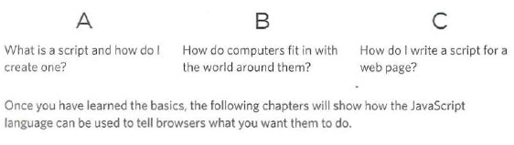

# JavaScript 

Tody we are going to learn about `JavaScript` it also called `JS`

> JavaScript can be used in browsers to make a website more interactive,
intresting,and user friendly
> JavaScript is a programing language.

### First thing first :
 you will need a basic knowldge to know how to build webpages using **HTML and CSS**

### After that :
You know about :
1. Basic progroaming consepts .
2. The language itself.
3.  How to applied what you learn .

If you are writing an Js code inside html page it should be in `` Tag 

You can use the JS to :
1. Access content 
1. Modify Content 
1. Program rule 
1. React 

> Befor looking at java Scripts lets calairfy some Html & Css Terms 

 #### Before you learn how to read and write in js languge itself you need to become familiar with some key 

## How to write a Script :
* To write a Script you need at first
    1. Set your goal 
    2. list the task 
    3. complete the task in order to achive it 

* Start with a big picture 
> After setting the goal 
    * Define it 
    * Design the Script for it 
    * Code each steps 

