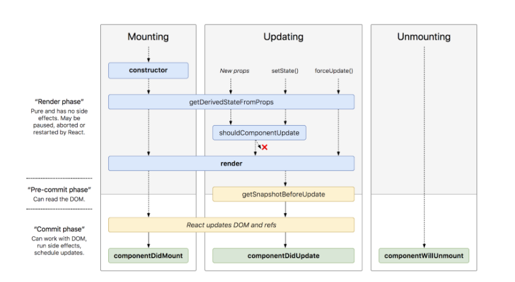

# Component Composition

1. In React we can access the child’s state using Refs.  we will assign a Refs for the child component in the parent component. then using Refs we can access the child’s state.
2. Object methods variable 
3. as a props 

-------------------------

## The Component Lifecycle 

 

- Mounting 

    Since class-based components are classes, hence the name, the first method that runs is the constructor method. Typically, the constructor is where you would initialize component state.

    Next, the component runs the getDerivedStateFromProps
    Now we come to the render method which returns your JSX. Now React “mounts” onto the DOM.

    Lastly, the componentDidMount method runs. Here is where you would do any asynchronous calls to databases or directly manipulate the DOM if you need. Just like that, our component is born.

- Updating
  This phase is triggered every time state or props change.
  Like in mounting, getDerivedStateFromProps is called (but no constructor this time!)
  Next shouldComponentUpdate runs. Here you can compare old props/state with the new set of props/state. You can determine if your component should re-render or not by returning true or false. This can make your web app more efficient by cutting down on extra re-renders. If shouldComponentUpdate returns false, this update cycle ends.

    If not, React re-renders and getSnapshotBeforeUpdate runs afterwards. This method has limited use as well. React then runs componentDidUpdate. Like componentDidMount you can use it to make any async calls or manipulate the DOM.

- Unmounting
  Our component lived a good life, but all good things must come to an end. The unmounting phase is that last stage of the component lifecycle. When you remove a component from the DOM, React runs componentWillUnmount right before it gets removed. You should use this method to clean up any open connections such as WebSockets or intervals.

  
## Higher-Order Components

    A higher-order component is a function that takes a component and returns a new component

##  React State and setState()
    This method takes an object and merges it into the current state. 
    setState is asynchronous. This means state won’t update exactly after you call setState and this can lead to some aggravating behavior which we will hopefully now be able to avoid!

##  React Context 
    This brings us now to React context which is just global state for components.
    The React context API allows you to create global context objects that can be given to any component you make. This allows you to share data without having to pass props down all the way through the DOM tree.

## Composition vs Inheritance

what object can do 

what object are and how they related to each other

